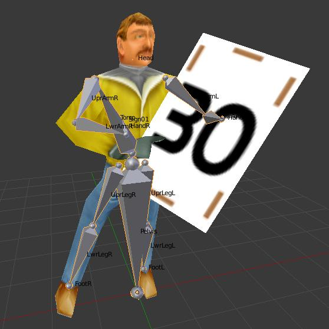

### Formats
#### Motocross Madness (1998)

| № | Format/Ext | Progress   | Template (010 Editor) |  Description   |
| :-- | :------- | :-- | :-- | :-- | 
|  **1**  | DAT  |    | [DAT1.bt](./templates/DAT1.bt) | Game resources file  |
|  **2**  | TRN  |    | [TRN.bt](./templates/TRN.bt) | Track data  |
|  **3**  | VUB   |    | [VUB.bt](./templates/VUB.bt) | Animations |

#### Motocross Madness 2 (2000)
| № | Format/Ext | Progress   | Template (010 Editor) |  Description   |
| :-- | :------- | :-- | :-- | :-- | 
|  **1**  |  DAT  |    | [DAT2.bt](./templates/DAT2.bt) | Game resources file  |
|  **2**  |  ESB  |    | [ESB.bt](./templates/ESB.bt) | Track eco system definitions binary  |
|  **3**  |  TDF  |    | [TDF.bt](./templates/TDF.bt) | Track definition (border splines)  |
|  **4**  |  SLB  |    | [SLB.bt](./templates/SLB.bt) | Game models binary  |
|  **5**  |  TGA  |    | [TGA2.bt](./templates/TGA2.bt) | Game LZW compressed bitmaps  |
### Scripts
* [DecodeRES.1sc](./scripts/DecodeRES.1sc) - script to decode MM2 .dat files
* [unpackDAT.1sc](./scripts/unpackDAT.1sc) - script to unpack MM1 .dat files
* [unpackDAT2.1sc](./scripts/unpackDAT2.1sc) - script to unpack MM2 .dat files
* [unpackDAT2.1sc](./scripts/unpackDAT2.1sc) - script to unpack MM2 .dat files
* [importSLB.py](./scripts/importSLB.py) - blender 2.76 script to import MM2 .slb files
* [importSLT.py](./scripts/importSLT.py) - blender 2.76 script to import MM2 .slt files

### Tool
Program in C for unpacking MCM2 archive formats and tga conversion. Build with `make`. Example usage: `./mcm2tool.out c 4Runner_Blue_08.tga`, `./mcm2tool.out e AIRFIELD.ENV` (make sure to create OUTPUT directory).

